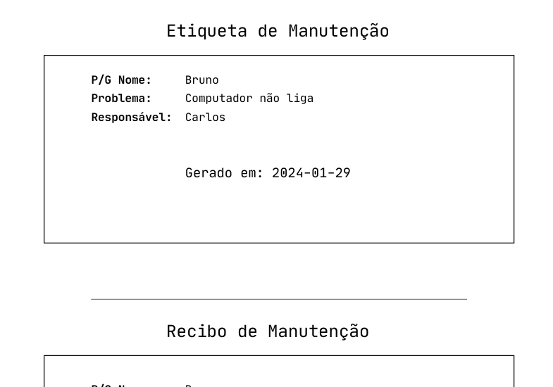

### Olá! 

Esse é um repositório simples de geração de recibos e etiquetas para manutenção de computadores em helpdesk.

---

No nosso time de T.I, os usuários trazem seus computadores defeituosos para manutenção, entregamos um recibo com a assinatura de quem vai manutenir o computador e uma etiqueta que vai ser colada no PC.

Inicie um ambiente virtual
```shell
python -m venv venv
.\venv\Scripts\activate
```
rode o projeto
```shell
python chamado.py
```

acesse: http://127.0.0.1:5000/api/chamados

- utilize um HTTP CLient (Bruno, Postman, Insomnia)

### POST
```json
{
           "nome": "3º Sgt AUDREYSON",
           "data": "2024-01-29",
           "problema": "PC Lento",
           "operador": "Cb MORALES"
         }
```

### GET 

http://127.0.0.1:5000/api/chamados
para listar todos chamados em forma de API (json)
```json
[
  {
    "data": "2024-01-29",
    "id": 1,
    "nome": "Bruno",
    "operador": "Carlos",
    "problema": "Computador não liga"
  },
  {
    "data": "2024-01-29",
    "id": 2,
    "nome": "Bruno",
    "operador": "Carlos",
    "problema": "Computador não liga"
  },
  {
    "data": "2024-01-29",
    "id": 3,
    "nome": "3º Sgt AUDREYSON",
    "operador": "Cb MORALES",
    "problema": "Computador não liga"
  }
]
```

### PDF
**GET** http://127.0.0.1:5000/api/chamados/recibo/{id} para obter o PDF do chamado:
